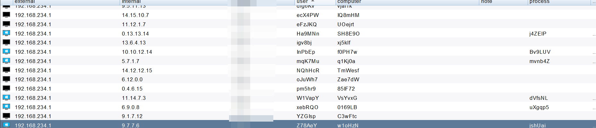

# CS_mock
模拟cobalt strike beacon上线包.  Simulation cobalt strike beacon connection packet.

拿到c2通信使用的RSA public key和提交metedata的url 即可模拟上线

Use the CobaltStrikeParser extract public key from the payload https://github.com/Sentinel-One/CobaltStrikeParser  parse_beacon_config.py payload_url --json

Remember to remove the extra padding from the public key

